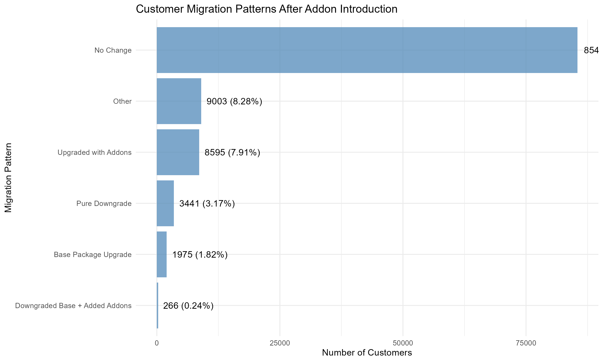
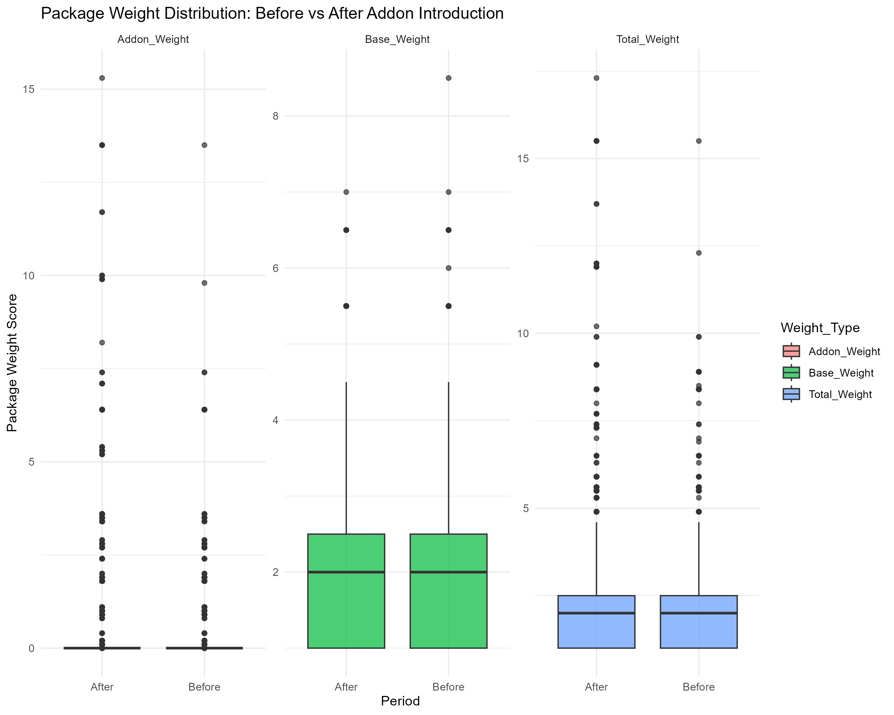
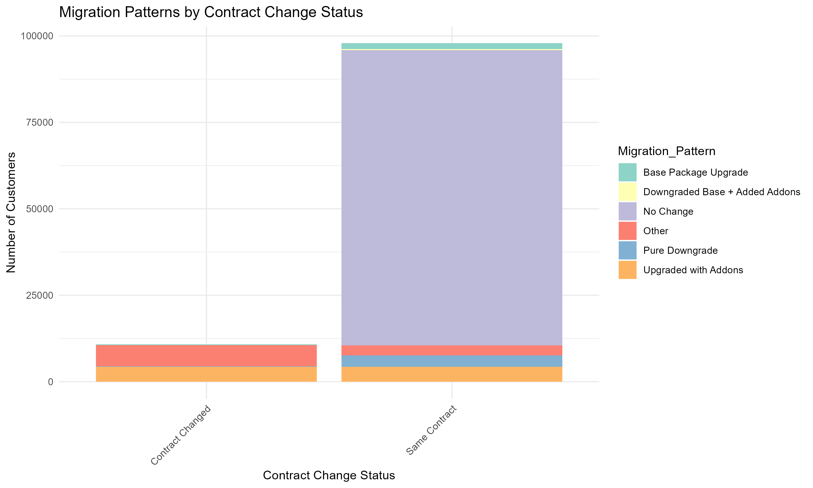
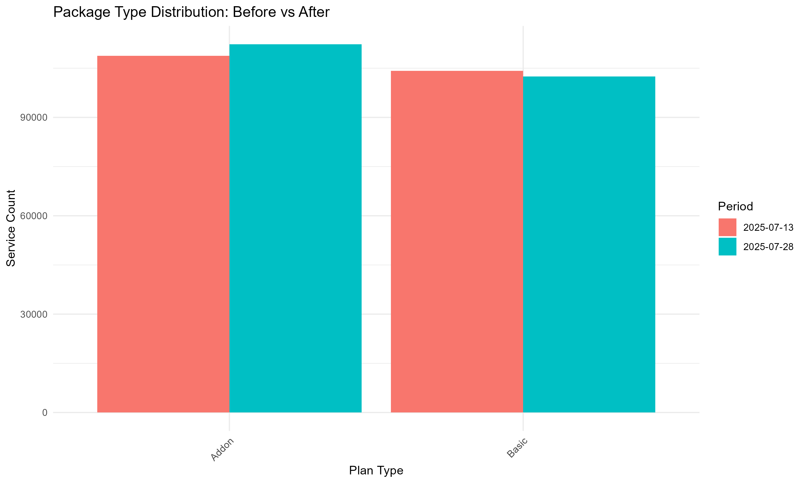

---
output:
  word_document: default
  html_document: default
---

# Customer Package Migration Analysis Report
## Period: July 13, 2025 vs July 28, 2025

---

## Executive Summary

This analysis examines customer behavior following the introduction of addon packages (Sports, Movies, Kids addons at lower price points). The primary concern was whether customers would downgrade their base packages and add specific addons instead of maintaining higher-value comprehensive packages.

**Key Finding:** 0.24% of customers (266 out of 108713) adopted the concerning pattern of downgrading base packages while adding addons.

---

## Risk Assessment

🟢 **LOW RISK**: Only 0.24% of customers showing concerning migration pattern

**Overall Package Weight Change:** ↗️ 0 points (Average: 1.98 → 1.98)

---

## Migration Pattern Analysis

### Customer Behavior Breakdown:

- **➖ No Change:** 85433 customers (78.59%)
- **⚪ Other:** 9003 customers (8.28%)
- **🟢 Upgraded with Addons:** 8595 customers (7.91%)
- **📉 Pure Downgrade:** 3441 customers (3.17%)
- **📈 Base Package Upgrade:** 1975 customers (1.82%)
- **🔴 Downgraded Base + Added Addons:** 266 customers (0.24%)

---

## Package Weight Distribution Analysis

The package weight analysis shows the distribution of customer package values before and after the addon introduction.

---

## Contract Change Impact

### Contract Change Summary:

- **Same Contract:** 97909 customers
- **Contract Changed:** 10804 customers

---

## Package Type Trends

### Service Count Changes by Package Type:

- **Addon:** 108788 → 112273 services ↗️ (+3485, 3.2%)
- **Basic:** 104194 → 102456 services ↘️ (-1738, -1.67%)

---

## Business Recommendations

### Immediate Actions:
1. **Monitor High-Risk Customers**: Focus on the 266 customers who downgraded base packages
2. **Pricing Strategy Review**: Consider adjusting addon pricing if revenue impact is significant
3. **Customer Communication**: Engage with customers to understand their decision drivers

### Strategic Considerations:
- **Addon Strategy Impact**: Addon strategy showing positive results
- **Package Portfolio**: Review base package value proposition vs addon combinations
- **Revenue Protection**: Implement safeguards against excessive base package downgrades

---

## Data Quality Notes
- **Analysis Period**: 7-day comparison (July 13-28, 2025)
- **Customer-Level Analysis**: Grouped by Customer Number to avoid contract change duplications  
- **Total Customers Analyzed**: 108713
- **Data Completeness**: Both datasets successfully processed and compared

---

*Generated on: 2025-07-30*
*Analysis conducted using package weight methodology with comprehensive migration pattern classification*

