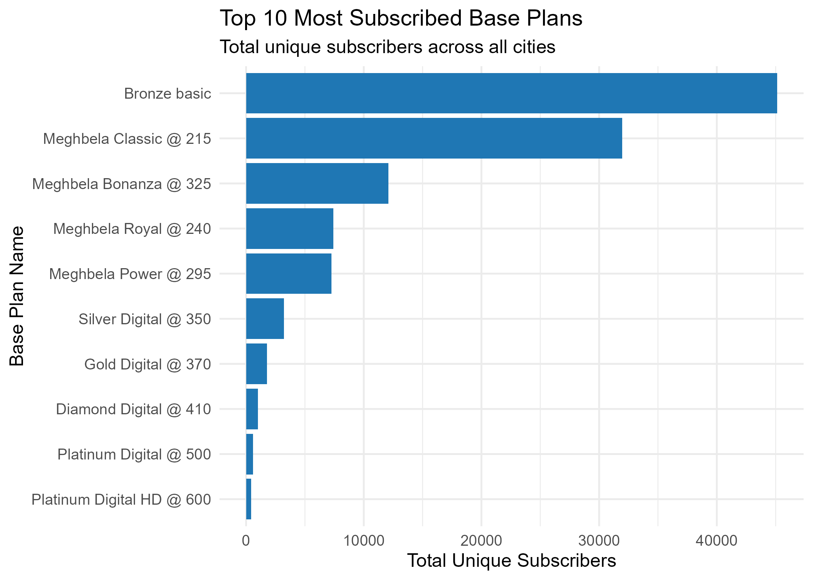
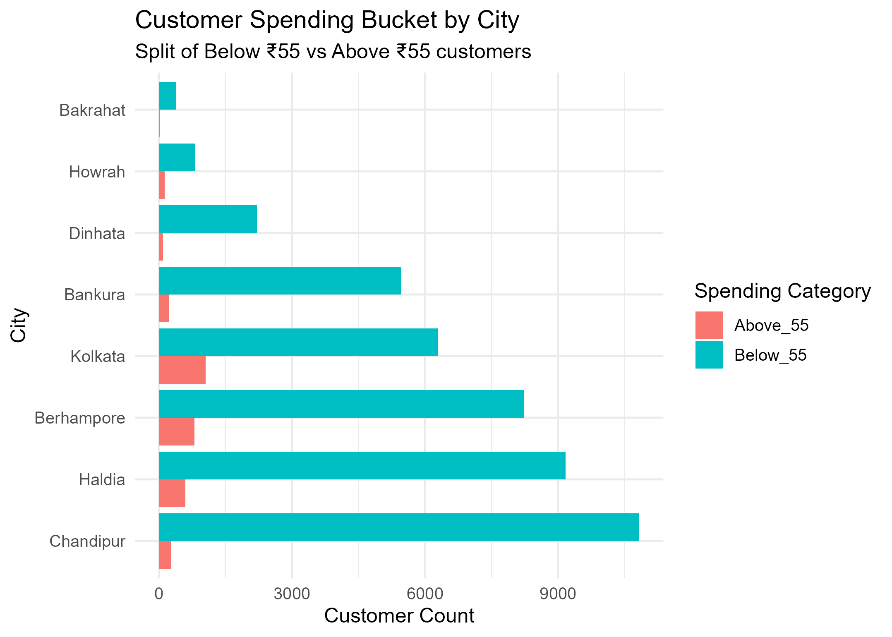

---
output:
  pdf_document: default
  html_document: default
---
# Analytical Report

### Charts

## 1. Unique Customer Count per Base Plan
|LCO_CITY   |PLAN_NAME                       | Plan_Customers| Total_Customers_City| Percentage|
|:----------|:-------------------------------|--------------:|--------------------:|----------:|
|Chandipur  |Bronze basic                    |          11317|                21846|      51.80|
|Haldia     |Bronze basic                    |           9556|                20664|      46.24|
|Berhampore |Bronze basic                    |           9236|                14945|      61.80|
|Kolkata    |Bronze basic                    |           5988|                31212|      19.18|
|Bankura    |Bronze basic                    |           5514|                12451|      44.29|
|Dinhata    |Bronze basic                    |           2310|                 5286|      43.70|
|Howrah     |Bronze basic                    |            800|                 4653|      17.19|
|Bakrahat   |Bronze basic                    |            399|                 1241|      32.15|
|Kolkata    |DD Channels                     |              7|                31212|       0.02|
|Kolkata    |Diamond Digital @ 410           |            722|                31212|       2.31|
|Howrah     |Diamond Digital @ 410           |            248|                 4653|       5.33|
|Haldia     |Diamond Digital @ 410           |             15|                20664|       0.07|
|Berhampore |Diamond Digital @ 410           |             11|                14945|       0.07|
|Chandipur  |Diamond Digital @ 410           |              4|                21846|       0.02|
|Dinhata    |Diamond Digital @ 410           |              3|                 5286|       0.06|
|Bakrahat   |Diamond Digital @ 410           |              1|                 1241|       0.08|
|Kolkata    |Diamond Digital HD @ 500        |            286|                31212|       0.92|
|Howrah     |Diamond Digital HD @ 500        |             35|                 4653|       0.75|
|Berhampore |Diamond Digital HD @ 500        |             26|                14945|       0.17|
|Haldia     |Diamond Digital HD @ 500        |             13|                20664|       0.06|
|Chandipur  |Diamond Digital HD @ 500        |              3|                21846|       0.01|
|Kolkata    |Gold Digital @ 370              |           1598|                31212|       5.12|
|Howrah     |Gold Digital @ 370              |            103|                 4653|       2.21|
|Berhampore |Gold Digital @ 370              |             34|                14945|       0.23|
|Haldia     |Gold Digital @ 370              |             22|                20664|       0.11|
|Bankura    |Gold Digital @ 370              |              9|                12451|       0.07|
|Dinhata    |Gold Digital @ 370              |              8|                 5286|       0.15|
|Bakrahat   |Gold Digital @ 370              |              5|                 1241|       0.40|
|Chandipur  |Gold Digital @ 370              |              5|                21846|       0.02|
|Kolkata    |Gold Digital Bengali HD @ 300   |            187|                31212|       0.60|
|Berhampore |Gold Digital Bengali HD @ 300   |             38|                14945|       0.25|
|Howrah     |Gold Digital Bengali HD @ 300   |             31|                 4653|       0.67|
|Chandipur  |Gold Digital Bengali HD @ 300   |             19|                21846|       0.09|
|Haldia     |Gold Digital Bengali HD @ 300   |             14|                20664|       0.07|
|Bankura    |Gold Digital Bengali HD @ 300   |             11|                12451|       0.09|
|Bakrahat   |Gold Digital Bengali HD @ 300   |              5|                 1241|       0.40|
|Dinhata    |Gold Digital Bengali HD @ 300   |              2|                 5286|       0.04|
|Kolkata    |Gold Digital Hindi HD @ 350     |             21|                31212|       0.07|
|Haldia     |Gold Digital Hindi HD @ 350     |              7|                20664|       0.03|
|Berhampore |Gold Digital Hindi HD @ 350     |              6|                14945|       0.04|
|Howrah     |Gold Digital Hindi HD @ 350     |              3|                 4653|       0.06|
|Bakrahat   |Gold Digital Hindi HD @ 350     |              1|                 1241|       0.08|
|Kolkata    |Gold Digital Special HD @ 450   |             24|                31212|       0.08|
|Haldia     |Meghbela Basic Pack @ 155       |             64|                20664|       0.31|
|Chandipur  |Meghbela Basic Pack @ 155       |             61|                21846|       0.28|
|Kolkata    |Meghbela Basic Pack @ 155       |             51|                31212|       0.16|
|Bankura    |Meghbela Basic Pack @ 155       |             19|                12451|       0.15|
|Howrah     |Meghbela Basic Pack @ 155       |              3|                 4653|       0.06|
|Berhampore |Meghbela Basic Pack @ 155       |              2|                14945|       0.01|
|Kolkata    |Meghbela Bonanza @ 325          |           6045|                31212|      19.37|
|Haldia     |Meghbela Bonanza @ 325          |           1867|                20664|       9.04|
|Berhampore |Meghbela Bonanza @ 325          |           1134|                14945|       7.59|
|Dinhata    |Meghbela Bonanza @ 325          |            886|                 5286|      16.76|
|Howrah     |Meghbela Bonanza @ 325          |            825|                 4653|      17.73|
|Chandipur  |Meghbela Bonanza @ 325          |            792|                21846|       3.63|
|Bankura    |Meghbela Bonanza @ 325          |            414|                12451|       3.33|
|Bakrahat   |Meghbela Bonanza @ 325          |            131|                 1241|      10.56|
|Chandipur  |Meghbela Classic @ 215          |           8918|                21846|      40.82|
|Haldia     |Meghbela Classic @ 215          |           6984|                20664|      33.80|
|Bankura    |Meghbela Classic @ 215          |           5634|                12451|      45.25|
|Kolkata    |Meghbela Classic @ 215          |           5242|                31212|      16.79|
|Berhampore |Meghbela Classic @ 215          |           3033|                14945|      20.29|
|Dinhata    |Meghbela Classic @ 215          |           1172|                 5286|      22.17|
|Howrah     |Meghbela Classic @ 215          |            632|                 4653|      13.58|
|Bakrahat   |Meghbela Classic @ 215          |            343|                 1241|      27.64|
|Kolkata    |Meghbela Hindi Basic @ 260      |             76|                31212|       0.24|
|Howrah     |Meghbela Hindi Basic @ 260      |             12|                 4653|       0.26|
|Chandipur  |Meghbela Hindi Basic @ 260      |              3|                21846|       0.01|
|Haldia     |Meghbela Hindi Basic @ 260      |              2|                20664|       0.01|
|Bakrahat   |Meghbela Hindi Basic @ 260      |              1|                 1241|       0.08|
|Bankura    |Meghbela Hindi Basic @ 260      |              1|                12451|       0.01|
|Kolkata    |Meghbela Hindi Package @ 300    |            293|                31212|       0.94|
|Howrah     |Meghbela Hindi Package @ 300    |             26|                 4653|       0.56|
|Haldia     |Meghbela Hindi Package @ 300    |             16|                20664|       0.08|
|Chandipur  |Meghbela Hindi Package @ 300    |              3|                21846|       0.01|
|Berhampore |Meghbela Hindi Package @ 300    |              1|                14945|       0.01|
|Kolkata    |Meghbela Power @ 295            |           4620|                31212|      14.80|
|Haldia     |Meghbela Power @ 295            |            823|                20664|       3.98|
|Howrah     |Meghbela Power @ 295            |            580|                 4653|      12.47|
|Berhampore |Meghbela Power @ 295            |            495|                14945|       3.31|
|Chandipur  |Meghbela Power @ 295            |            319|                21846|       1.46|
|Dinhata    |Meghbela Power @ 295            |            301|                 5286|       5.69|
|Bankura    |Meghbela Power @ 295            |            127|                12451|       1.02|
|Bakrahat   |Meghbela Power @ 295            |              5|                 1241|       0.40|
|Kolkata    |Meghbela Royal @ 240            |           3086|                31212|       9.89|
|Haldia     |Meghbela Royal @ 240            |           1148|                20664|       5.56|
|Berhampore |Meghbela Royal @ 240            |            754|                14945|       5.05|
|Bankura    |Meghbela Royal @ 240            |            664|                12451|       5.33|
|Howrah     |Meghbela Royal @ 240            |            559|                 4653|      12.01|
|Dinhata    |Meghbela Royal @ 240            |            551|                 5286|      10.42|
|Bakrahat   |Meghbela Royal @ 240            |            339|                 1241|      27.32|
|Chandipur  |Meghbela Royal @ 240            |            323|                21846|       1.48|
|Kolkata    |Platinum Digital @ 500          |            370|                31212|       1.19|
|Howrah     |Platinum Digital @ 500          |            216|                 4653|       4.64|
|Berhampore |Platinum Digital @ 500          |              8|                14945|       0.05|
|Haldia     |Platinum Digital @ 500          |              5|                20664|       0.02|
|Chandipur  |Platinum Digital @ 500          |              2|                21846|       0.01|
|Dinhata    |Platinum Digital @ 500          |              1|                 5286|       0.02|
|Kolkata    |Platinum Digital HD @ 600       |            364|                31212|       1.17|
|Howrah     |Platinum Digital HD @ 600       |             62|                 4653|       1.33|
|Berhampore |Platinum Digital HD @ 600       |              7|                14945|       0.05|
|Haldia     |Platinum Digital HD @ 600       |              5|                20664|       0.02|
|Bakrahat   |Platinum Digital HD @ 600       |              1|                 1241|       0.08|
|Chandipur  |Platinum Digital HD @ 600       |              1|                21846|       0.00|
|Dinhata    |Platinum Digital HD @ 600       |              1|                 5286|       0.02|
|Kolkata    |Silver Digital @ 350            |           2227|                31212|       7.14|
|Howrah     |Silver Digital @ 350            |            518|                 4653|      11.13|
|Berhampore |Silver Digital @ 350            |            160|                14945|       1.07|
|Haldia     |Silver Digital @ 350            |            123|                20664|       0.60|
|Chandipur  |Silver Digital @ 350            |             76|                21846|       0.35|
|Bankura    |Silver Digital @ 350            |             58|                12451|       0.47|
|Dinhata    |Silver Digital @ 350            |             51|                 5286|       0.96|
|Bakrahat   |Silver Digital @ 350            |             10|                 1241|       0.81|
|Kolkata    |Silver Digital Special HD @ 370 |              5|                31212|       0.02|

## 2. LCO City-wise JioStar Alacarte/Add-on Value Analysis

|LCO_CITY   |PLAN_NAME_BASE                | Count_Above_55| Count_Below_55|
|:----------|:-----------------------------|--------------:|--------------:|
|Chandipur  |Bronze basic                  |            269|           9980|
|Haldia     |Bronze basic                  |            584|           7836|
|Berhampore |Bronze basic                  |            796|           7567|
|Bankura    |Bronze basic                  |            220|           4839|
|Kolkata    |Bronze basic                  |           1025|           4285|
|Dinhata    |Bronze basic                  |             94|           1975|
|Howrah     |Bronze basic                  |            125|            564|
|Bakrahat   |Bronze basic                  |             22|            328|
|Kolkata    |DD Channels                   |              1|              6|
|Kolkata    |Diamond Digital @ 410         |              1|             60|
|Howrah     |Diamond Digital @ 410         |              0|             16|
|Berhampore |Diamond Digital @ 410         |              0|              2|
|Chandipur  |Diamond Digital @ 410         |              1|              1|
|Haldia     |Diamond Digital @ 410         |              0|              1|
|Kolkata    |Diamond Digital HD @ 500      |              1|             17|
|Berhampore |Diamond Digital HD @ 500      |              2|              3|
|Howrah     |Diamond Digital HD @ 500      |              0|              2|
|Haldia     |Diamond Digital HD @ 500      |              0|              1|
|Kolkata    |Gold Digital @ 370            |              2|             46|
|Berhampore |Gold Digital @ 370            |              0|              2|
|Haldia     |Gold Digital @ 370            |              0|              2|
|Bankura    |Gold Digital @ 370            |              0|              1|
|Dinhata    |Gold Digital @ 370            |              0|              1|
|Howrah     |Gold Digital @ 370            |              0|              1|
|Kolkata    |Gold Digital Bengali HD @ 300 |              4|             43|
|Berhampore |Gold Digital Bengali HD @ 300 |              0|              8|
|Howrah     |Gold Digital Bengali HD @ 300 |              2|              7|
|Haldia     |Gold Digital Bengali HD @ 300 |              0|              3|
|Chandipur  |Gold Digital Bengali HD @ 300 |              0|              2|
|Bakrahat   |Gold Digital Bengali HD @ 300 |              0|              1|
|Bankura    |Gold Digital Bengali HD @ 300 |              0|              1|
|Kolkata    |Gold Digital Hindi HD @ 350   |              0|              7|
|Berhampore |Gold Digital Hindi HD @ 350   |              0|              3|
|Haldia     |Gold Digital Hindi HD @ 350   |              0|              3|
|Bakrahat   |Gold Digital Hindi HD @ 350   |              0|              1|
|Howrah     |Gold Digital Hindi HD @ 350   |              0|              1|
|Kolkata    |Gold Digital Special HD @ 450 |              0|              5|
|Haldia     |Meghbela Basic Pack @ 155     |              2|             58|
|Chandipur  |Meghbela Basic Pack @ 155     |              3|             48|
|Kolkata    |Meghbela Basic Pack @ 155     |              3|             19|
|Bankura    |Meghbela Basic Pack @ 155     |              1|             15|
|Berhampore |Meghbela Basic Pack @ 155     |              0|              2|
|Howrah     |Meghbela Basic Pack @ 155     |              0|              2|
|Kolkata    |Meghbela Bonanza @ 325        |              0|            458|
|Haldia     |Meghbela Bonanza @ 325        |              3|            106|
|Berhampore |Meghbela Bonanza @ 325        |              0|             87|
|Dinhata    |Meghbela Bonanza @ 325        |              0|             66|
|Howrah     |Meghbela Bonanza @ 325        |              0|             63|
|Chandipur  |Meghbela Bonanza @ 325        |              2|             25|
|Bankura    |Meghbela Bonanza @ 325        |              0|             23|
|Bakrahat   |Meghbela Bonanza @ 325        |              0|             13|
|Haldia     |Meghbela Classic @ 215        |              4|            880|
|Kolkata    |Meghbela Classic @ 215        |             10|            774|
|Chandipur  |Meghbela Classic @ 215        |              1|            746|
|Bankura    |Meghbela Classic @ 215        |              0|            539|
|Berhampore |Meghbela Classic @ 215        |              1|            473|
|Dinhata    |Meghbela Classic @ 215        |              0|            117|
|Howrah     |Meghbela Classic @ 215        |              1|             79|
|Bakrahat   |Meghbela Classic @ 215        |              0|             26|
|Kolkata    |Meghbela Hindi Basic @ 260    |              0|              4|
|Howrah     |Meghbela Hindi Basic @ 260    |              0|              1|
|Kolkata    |Meghbela Hindi Package @ 300  |              0|             21|
|Haldia     |Meghbela Hindi Package @ 300  |              0|              3|
|Howrah     |Meghbela Hindi Package @ 300  |              0|              2|
|Berhampore |Meghbela Hindi Package @ 300  |              0|              1|
|Kolkata    |Meghbela Power @ 295          |              1|            179|
|Haldia     |Meghbela Power @ 295          |              0|             39|
|Berhampore |Meghbela Power @ 295          |              0|             18|
|Howrah     |Meghbela Power @ 295          |              0|             15|
|Dinhata    |Meghbela Power @ 295          |              0|             13|
|Chandipur  |Meghbela Power @ 295          |              0|              7|
|Bankura    |Meghbela Power @ 295          |              0|              5|
|Kolkata    |Meghbela Royal @ 240          |              4|            248|
|Haldia     |Meghbela Royal @ 240          |              0|            233|
|Berhampore |Meghbela Royal @ 240          |              0|             52|
|Bankura    |Meghbela Royal @ 240          |              0|             41|
|Dinhata    |Meghbela Royal @ 240          |              0|             39|
|Howrah     |Meghbela Royal @ 240          |              0|             29|
|Bakrahat   |Meghbela Royal @ 240          |              0|             22|
|Chandipur  |Meghbela Royal @ 240          |              0|             17|
|Kolkata    |Platinum Digital @ 500        |              3|              6|
|Howrah     |Platinum Digital @ 500        |              0|              4|
|Berhampore |Platinum Digital @ 500        |              0|              1|
|Chandipur  |Platinum Digital @ 500        |              0|              1|
|Kolkata    |Platinum Digital HD @ 600     |              0|             17|
|Howrah     |Platinum Digital HD @ 600     |              1|              6|
|Berhampore |Platinum Digital HD @ 600     |              0|              2|
|Haldia     |Platinum Digital HD @ 600     |              0|              1|
|Chandipur  |Platinum Digital HD @ 600     |              1|              0|
|Kolkata    |Silver Digital @ 350          |              1|             98|
|Howrah     |Silver Digital @ 350          |              0|             22|
|Berhampore |Silver Digital @ 350          |              0|              9|
|Chandipur  |Silver Digital @ 350          |              0|              4|
|Dinhata    |Silver Digital @ 350          |              0|              2|
|Bankura    |Silver Digital @ 350          |              0|              1|
|Haldia     |Silver Digital @ 350          |              0|              1|
